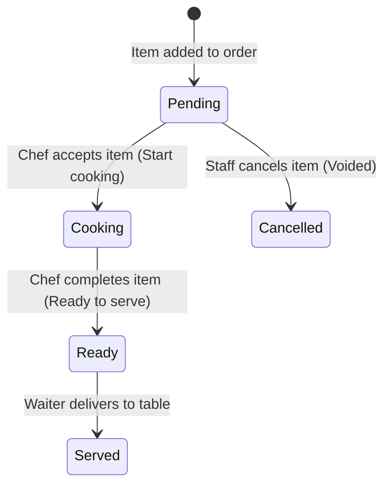

# F&B SaaS System - Core Business Rules & Operational Behaviors

This document serves as the single source of truth for the F&B Multi-Tenant POS & KDS business logic, designed to align AI agents and developers. It details the backend architectures, database schemas, API flows, real-time protocols, and frontend state behaviors.

---

## 1. Tenant Scoping & Isolation (Data Security)

- **Multi-Tenant SaaS**: The system hosts multiple independent restaurants (Tenants).
- **Strict Data Isolation**: Every entity (Users, Tables, Products, Orders, Notifications) is explicitly scoped to a `tenant_id` (UUID). Under no circumstances can data from one `tenant_id` leak to another.
- **Tenant Context**: The backend middleware intercepts requests, validates the JWT, and extracts the `tenant_id`, setting it in the request local context (`c.Locals("tenant_id")`). All DB queries are scoped using GORM where-clauses using this `tenant_id`.
- **System-level Bypass**: Only users with the global `system_role` of `superuser` or `admin` (e.g. platform administrators) can bypass tenant checks (for SaaS billing, metrics auditing, and tenant onboarding).

---

## 2. Role-Based Access Control (RBAC) & Scopes

Permissions are divided into Global (System) and Tenant (Restaurant) levels:

### 2.1. System-Level Roles
- **`superuser` / `admin`**: Global platform owners. They onboard tenants and create the first Tenant `Owner` account. Stored under the `users` table as `system_role`.
- **`user`**: Default role for standard users and staff.

### 2.2. Tenant-Level Roles (Stored in `TenantMember` pivot)
- **`Owner`**: Holds complete control over their restaurant tenant. Can manage settings (like VAT, bank info, printers), view revenue dashboards, manage staff, design the menu catalog, and manage tables.
- **`Manager`**: Can handle daily operations, edit the menu catalog, configure tables, and perform checkouts. Cannot modify core tenant parameters (like changing bank info, subscription status, or deleting the tenant).
- **`Staff` (Cashier, Waiter, Chef)**: The front-line workers. They share a single unified role in the database but can perform all operational tasks: POS checkouts, taking orders, updating table statuses, interacting with the KDS queue, serving dishes, and paging waitstaff.
- **`Guest`**: Temporary tokenless role. Assumed by customers scanning table QR codes. Restricted strictly to reading the menu, opening a guest cart, adding items, and viewing their active bill.

### 2.3. Role-Permission Matrix

| Action | Superuser / Admin | Owner | Manager | Staff | Guest |
| :--- | :---: | :---: | :---: | :---: | :---: |
| Onboard Tenants / Global Admins | Yes | No | No | No | No |
| Edit Tenant Settings (VAT, Bank Info) | Yes | Yes | No | No | No |
| Manage Staff Accounts | No | Yes | No | No | No |
| Manage Product Catalog & Menu | No | Yes | Yes | No | No |
| Manage Tables & Zones | No | Yes | Yes | No | No |
| Place Orders / Add Items to Table | No | Yes | Yes | Yes | Yes |
| Kitchen Queue Controls (KDS) | No | Yes | Yes | Yes | No |
| Checkout & Cashout Bills | No | Yes | Yes | Yes | No |

---

## 3. Physical Entities & Menu Catalog

### 3.1. Tables & Zones
- **`Table`**: Represents a physical dining table. Stored with a `name` (e.g., "Bàn 1", "VIP-1"), a `zone` (e.g., "Tầng 1", "Tất cả"), and a `status`.
- **Table Statuses**:
  - `Available`: Ready for new guests.
  - `Occupied`: Active dining session exists.
- **QR Codes**: Every table has a unique QR code encoding a short-term encrypted JWT containing the `tenant_id` and `table_id`. Scanning this QR allows a customer to access the menu as a `Guest`.

### 3.2. Product Catalog
- **`Product`**: Represents a menu item with a `name`, `category` (e.g., "Nước uống", "Món khai vị"), `description`, `price`, `image_url`, and `is_available` boolean.
- Menu changes (price, availability) update the catalog immediately. Active order items keep the price they were ordered at.

---

## 4. Order & Session Lifecycle (Table-Scoped Sessions)

Unlike traditional e-commerce, F&B operations are centered around physical **Tables** and **Dining Sessions**.

### 4.1. Opening a Session (Table Check-in)
- A table is either `Available` or `Occupied`.
- To start ordering, staff or a Guest (via QR scan) must **Open a Session** for the Table.
- Opening a session:
  1. Creates an `Order` in `Pending` state.
  2. Generates a unique session ID (`session_id`).
  3. Updates the table status to `Occupied`.
- Only **one active order** can exist per table at any given time.

### 4.2. Guest QR Ordering & Cart Merging
1. **Access**: The customer scans the QR, enters the web menu tokenless, and acquires the Guest role.
2. **Session Identification**: The guest's device receives the active `session_id`. All orders added by guests at this table must carry this `session_id`.
3. **Cart Merging**: If multiple guests scan the same table, they join the same session. They see the same shared cart and can add items concurrently.
4. **Collision Prevention**: If a guest tries to modify a table order with an expired or mismatched `session_id`, the backend rejects the transaction.

### 4.3. Calculating Totals
- The `Order` holds a list of `OrderItems`.
- **`SubTotal`**: Calculated per order item as `quantity * price`.
- **`TotalPrice`**: The sum of all active `OrderItem` sub-totals. Voided/Cancelled items are excluded.
- Recalculating the order total happens automatically on the backend whenever items are added, updated in quantity, or cancelled.

---

## 5. Kitchen Display System (KDS) & Order Item States

Dishes inside an active order (`OrderItem`) have their own independent preparation lifecycle:

- **`Pending`**: Item has been added by waiter or guest. Appears in the KDS queue.
- **`Cooking`**: Chef clicks "Accept". Indicates preparation has started.
- **`Ready`**: Chef marks as done. Triggers a real-time event and push notification to the Waiter/POS ("Món X bàn 5 đã lên").
- **`Served`**: Waitstaff delivers the food and marks it as served.
- **`Cancelled`**: Voided item. Item is kept in the database for auditing but excluded from the bill calculations.
- **Real-Time Sync**: Any state change (`Pending -> Cooking -> Ready -> Served -> Cancelled`) MUST broadcast a real-time event (`ITEM_STATUS_UPDATED`) to all connected client nodes under the same `tenant_id` via WebSockets.

---

## 6. Checkout, Billing, & Table Release

### 6.1. Checkout Initiation
- Waiter or POS operator initiates checkout for an `Occupied` table.
- The system aggregates all non-cancelled `OrderItem` records, applies tax/VAT rules, and displays the payment options.

### 6.2. Payment Methods
- **Cash**: Cashier collects physical cash and completes transaction.
- **Card**: POS swipe/tap credit card processing.
- **Bank QR Code (VietQR/MoMo)**:
  - The system dynamically generates a payment QR code.
  - The QR encodes the Tenant's bank account (extracted from tenant metadata JSON: `bank_bin`, `account_no`), total price, and order ID/code as the transfer message.

### 6.3. Table Release
Once payment is successfully completed:
1. The `Order` status changes to `Paid` (or `Completed`).
2. The linked `Table` status is reset back to `Available`.
3. The table's `session_id` is invalidated/cleared, releasing the table for the next dining session.

---

## 7. Real-Time WebSocket Messaging & Sync

To ensure zero lag between waitstaff placing orders and chefs preparing them, the system implements a real-time WebSocket layer synchronized via Redis Pub/Sub.

### 7.1. Channel Namespaces
- WebSockets connections are scoped to tenants.
- Server broadcasts events to a Redis channel named: `tenant:<tenant_id>:events`.
- All replica instances of the backend listen to this channel and forward events to their locally connected WebSocket clients.

### 7.2. Core Event Types

- **`ORDER_CREATED`**: Sent when a new order session is opened.
- **`ORDER_UPDATED`**: Sent when new items are added to an existing order.
- **`ITEM_STATUS_UPDATED`**: Sent when an order item status shifts (e.g. `Pending` -> `Cooking`).
- **`TABLE_CALL_STAFF`**: Triggered when a guest clicks "Gọi nhân viên" from the QR ordering web view. POS and waitstaff devices display a pop-up and play a notification sound.

---

## 8. APNs & FCM Push Notifications

Push notifications ensure employees are notified even when the app is in the background or device is locked.

- **FCM Token Collection**: Waiter/POS devices register their Firebase Cloud Messaging (FCM) tokens with the backend via `POST /auth/devices` upon login.
- **APNs Key**: Apple Push Notification service authentication uses the `.p8` private key (`AuthKey_S77A4NC4RH.p8`) stored securely on the backend under the `configs/` folder and configured via environment variables.
- **Notification Routing**:
  - Chef marks item as `Ready` -> Backend queries waitstaff device tokens belonging to that `tenant_id` and sends: *"Bàn X: Món Y đã sẵn sàng!"*
  - Table guest clicks "Call Staff" -> Backend queries all logged-in staff tokens for the `tenant_id` and sends: *"Bàn X đang gọi phục vụ!"*
  - New Order / Added Items -> Backend pushes to topic `tenant_<tenant_id>_staff` to notify all active staff: *"Bàn X vừa tạo đơn hàng mới."* or *"Bàn X vừa đặt thêm Y món."*
  - **Platform Grouping (Android vs iOS)**: Android automatically groups app notifications in the tray. For iOS (APNs) to exhibit the same behavior, the backend injects a custom `thread-id` parameter (`tenant_<topic>_<notiType>`) in the APNs payload, stacking order updates and staff calls into separate expandable groups.

---

## 9. Flutter Frontend State & Serialization Standards

To maintain stability and prevent application crashes, the Flutter mobile client (`fnb_ui`) adheres to the following rules:

- **Riverpod Providers**:
  - `tableProvider`: Controls selected table selection.
  - `authProvider`: Manages session login states, JWTs, and FCM token registration.
  - `themeProvider`: Coordinates dynamic Light/Dark mode.
- **Safe JSON Deserialization**:
  - NEVER use direct dynamic casts like `data as Map<String, dynamic>`. A `List` or a redirect response from Cloudflare will cause a crash.
  - ALWAYS use safe casting: `Map<String, dynamic>.from(data as Map)` or explicit checking before access.
- **Lucide Icons Only**: Ensure styling uses `LucideIcons` instead of standard Material Icons to preserve modern design consistency.
- **Hardcoded Typography**: To prevent native path compilation errors on iOS devices, avoid importing external font packages at runtime. Use `app_text_styles.dart` constants.
