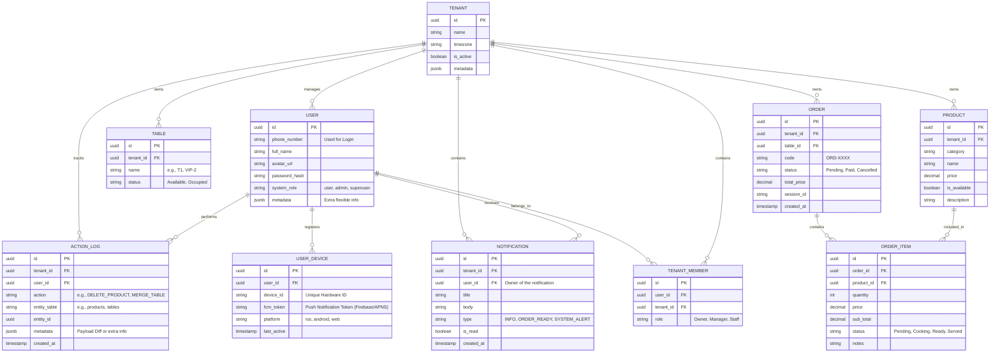

# F&B Management System - Backend Architecture

This document describes the high-performance, strictly isolated multi-tenant architecture designed to serve thousands of independent restaurants and franchises concurrently. The system leverages **Go** for maximum throughput, **PostgreSQL** for transactional persistence, and **Redis (Pub/Sub)** coupled with **WebSockets** for real-time Kitchen Display System (KDS) synchronization.

---

## 1. Multi-Tenant Strategy: Row-Level Security (RLS) via `tenant_id`

We use **Row-Level Security (RLS) via a `tenant_id` column** over Schema-per-Tenant.

### Justification:
- **Scalability:** Managing thousands of schemas makes database migrations extremely slow and error-prone. A single schema scales infinitely better.
- **Connection Optimization:** Schema-per-tenant often requires dedicated connection configurations or complex dynamic routing. A single schema allows highly efficient connection pooling (e.g., PgBouncer).
- **Security:** PostgreSQL's native RLS guarantees that queries strictly return data for the configured tenant, preventing accidental cross-tenant data leaks even if an explicit `WHERE tenant_id = ?` clause is missed in the application layer.
- **Simplified Maintenance:** Backups, restores, and analytics across all tenants are tremendously easier on a unified schema.

---

## 2. Role-Based Access Control (RBAC) Hierarchy

To support a SaaS model securely, permissions are explicitly divided into two distinct domains: **Global (SaaS Platform Level)** and **Tenant (Store Level)**.

### 2.1. Global Level (System Level - Ứng dụng SaaS)
- **`Superadmin` (Chủ App):** The ultimate system owner. Has unrestricted access to all tenants globally. Their `tenant_id` is typically `NULL`. They manage global configurations, system health, billing/subscriptions, and the onboarding, monitoring, or banning of Restaurant Tenants.
- **`Admin` (Nhân viên của Chủ App):** System Administrator or Customer Success staff. They assist the `Superadmin` in managing the SaaS platform, resolving tenant tickets, or configuring subscriptions, but may have restricted access compared to the Superadmin.

### 2.2. Tenant Level (Strictly scoped to a specific `tenant_id` - Nhà hàng/Quán ăn)
- **`Owner` (Chủ Quán):** The Owner of a specifically assigned restaurant. Holds full control over their restaurant's isolated data (creates staff accounts, designs the menu/products, manages tables, views financial metrics) but **cannot** view or modify anything outside their `tenant_id`.
- **`Manager` (Quản lý Quán):** Assists the Owner in daily operations. Can manage floor operations, resolve billing issues, or update the catalog, but cannot change core tenant settings (like VAT or deleting the tenant).
- **`Staff` (Nhân viên chung: Thu ngân, Bếp, Phục vụ):** The general workforce role. A single, versatile role that interacts with front-of-house (POS, Table Order) and back-of-house (KDS) operations securely within their tenant.

---

## 3. Project Directory Layout

We strictly follow the idiomatic Go project layout to ensure clean architecture, separation of concerns, and robust testability. Domain-Driven Design (DDD) principles dictate the core logic remains independent of the HTTP/DB frameworks.

```text
├── cmd/
│   ├── api/                     # Application entry point (obsolete, moved to server)
│   ├── server/                  # API HTTP & WebSocket Server entry point
│   ├── migrator/                # GORM Schema AutoMigrate script
│   └── seeder/                  # Initial data seeder script
├── internal/
│   ├── app/                     # App configuration & Server setup
│   ├── config/                  # Environment variables parsing
│   ├── core/                    # Core business logic (Interfaces, Models)
│   │   ├── domain/              # Entities (Tenant, Order, Table, etc.)
│   │   └── ports/               # Input/Output port definitions
│   ├── handlers/                # HTTP/WebSocket controllers (Fiber)
│   ├── middleware/              # Authentication, Rate Limiting, Tenant extraction
│   ├── repositories/            # Database implementations (Postgres/GORM)
│   └── services/                # Use-case business logic implementation
├── pkg/
│   ├── common/                  # Shared Constants, Enums, Error handling & Pagination
│   ├── db/                      # PostgreSQL connection setup
│   ├── logger/                  # Structured logging (Zap)
│   ├── pubsub/                  # Redis PubSub wrapper
│   └── ws/                      # Generic WebSocket connection manager
├── docs/                        # Swagger / OpenAPI specs & Architecture docs
├── go.mod
└── go.sum
```

### 3.1. Constants, Enums & Common Integrity
To prevent "magic strings" and standardize data integrity, all statuses and roles **MUST** map to typed Enums:
- **Enums Strategy:** Define Go Types via `iota` or explicitly exported string constants under `pkg/common/enums` (e.g., `OrderStatusPending = "PENDING"`). In PostgreSQL, these must be strictly validated.
- **Common Logic:** Any business-agnostic layer—like response formatting, global constants (`constants.go`) must reside cleanly in `pkg/common/` to be shared seamlessly.

### 3.2. Standardized Exception & Error Handling
Error handling relies on a **Dual-Layer Strategy** to guarantee system security and a smooth User Experience:
1. **Developer View (Internal Auditing via Zap):**
   - Captures deep execution stack traces, raw DB panics, SQL foreign-key violations, and exact line numbers. These detail logs are exclusively output to the CLI console or APM (e.g., Sentry).
2. **UI/Frontend View (Sanitized JSON Response):**
   - The Flutter application **never** receives raw backend exception strings. Internally, a unified `AppError` wrapper catches every panic/error and shapes it into a strictly formatted JSON payload before flushing.
   - It exposes a developer-agreed `error_code` (for enum-based logic handling/translations on mobile) and a highly friendly `message` tailored for the end consumer.

**Unified Error Response Contract:**
```json
{
  "success": false,
  "error_code": "ERR_INV_INSUFFICIENT_STOCK",
  "message": "Không thể thanh toán. Xin lỗi, món ăn này hiện đã hết hàng.",
  "status_code": 400
}
```

---

## 4. Database Schema Design

Below is the core Entity-Relationship structure representing the Multi-Tenant POS/KDS model. 

> **BaseModel & Isolation Rules:**
> 1. **Strict Data Isolation:** Every single tenant-owned table explicitly includes a `tenant_id` to strictly enforce scoping. A user authenticated under a specific Tenant can **never** view or mutate data belonging to another Tenant.
> 2. **BaseModel (Audit & Soft Deletes):** Standard tracking fields are embedded in *every* table via a Go `BaseModel` struct:
>    - `created_at` (Timestamp), `updated_at` (Timestamp)
>    - `modified_by` (UUID of the User who triggered the change)
>    - `is_deleted` (Boolean), `deleted_at` (Timestamp, for soft deletion).



---

## 5. Multi-Tenancy Implementation Guide

Absolute data isolation dynamically happens at the middleware and database layer.

### 5.1. JWT & Middleware Extraction
Users authenticate and receive a JWT containing their `user_id`, `role`, and `tenant_id` (unless they are a Superadmin/Admin). The `TenantMiddleware` and `RBACMiddleware` intercept API requests:
- Parses and decodes the JWT.
- Verifies the user `role` against Route RBAC policies.
- If the role is a Tenant-level role, it forcefully extracts `tenant_id` and injects it into the contextual payload. If missing, it rejects the request.
- If the role is `Superadmin` or `Admin`, it permits access to system-level global routes without strict scoping.

### 5.2. Context Injection (Fiber Example)
```go
func TenantMiddleware() fiber.Handler {
    return func(c *fiber.Ctx) error {
        claims := c.Locals("user").(*jwt.Token).Claims.(jwt.MapClaims)
        role := claims["role"].(string)

        // Superadmin and Admin bypass strict tenant isolation for system routes
        if role == "Superadmin" || role == "Admin" {
            return c.Next()
        }

        // Enforce tenant_id for all sub-roles
        tenantID, ok := claims["tenant_id"].(string)
        if !ok || tenantID == "" {
             return c.Status(403).JSON(fiber.Map{"error": "tenant isolation breach: missing tenant_id"})
        }

        // Set strictly in Fiber Locals (acts as per-request context variable)
        c.Locals("tenant_id", tenantID)
        return c.Next()
    }
}
```

### 5.3. Repository Layer Enforcement
At the database repository layer, we use GORM scopes to ensure every query automatically appends `WHERE tenant_id = ?`.

```go
func TenantScope(tenantID string) func(db *gorm.DB) *gorm.DB {
    return func(db *gorm.DB) *gorm.DB {
        return db.Where("tenant_id = ?", tenantID)
    }
}

// Usage in Service:
db.Scopes(TenantScope(tenantID)).Where("status = ?", "Pending").Find(&orders)
```

---

## 6. Real-time Gateway Concept (KDS & Table Sync)

The Kitchen Display System and live Table Occupancy demand high-performance, real-time sync. We accomplish this using a horizontally scalable WebSocket Gateway backed by Redis Pub/Sub.

### Architectural Flow:
1. **Connection Initiation:** Flutter app connects to `wss://api.system.com/ws?token=...`
2. **Upgrading & Routing:** The Gateway authenticates the token, assigns the connection to an in-memory Hub, and dynamically subscribes the unit to their specific tenant's Redis channel (e.g., `tenant:tx-999:events`).
3. **Event Broadcasting:**
   - Waiter submits an order via REST API (`POST /api/v1/orders`).
   - The Go HTTP Handler persists it to Postgres.
   - The Handler publishes a payload to Redis: `PUBLISH "tenant:tx-999:events" '{"type":"ORDER_CREATED", "data":{...}}'`.
4. **WebSocket Delivery:** The Gateway nodes listening to `tenant:tx-999:events` pick up the Redis message and push it down the TCP sockets to all KDS and Waiter devices connected under that `tenant_id`.

### Supported WebSocket Event Types
Every WS message is wrapped in a uniform JSON schema (`{ "type": "...", "payload": {...} }`):
- **`TABLE_STATUS_CHANGED`**: Fired when a table changes from Available to Occupied, or merged. (Triggers UI refresh on Floor map).
- **`ORDER_CREATED`**: Fired when a Waiter or Guest opens a new order ticket.
- **`ITEM_STATUS_UPDATED`**: Fired when a dish's status is modified (e.g., marking a dish as Cooking or Ready).
- **`TABLE_CALL_STAFF`**: Fired when a customer calls for staff assistance from Guest QR.

---

## 7. API Endpoints & RBAC Route Mapping

All RESTful routing resides behind versioned prefixes (`/api/v1/`). Every endpoint declares which **Roles** are authorized to access it.

### Core Routing & Permissions Matrix

**Authentication (/auth)** | *Public / Any Role*
- `POST /auth/login` - Authenticate user, returns JWT. (Public)
- `POST /auth/guest` - Log in a table guest using TenantID & TableID. (Public)
- `GET /auth/me` - Fetch own profile info.
- `POST /auth/devices` - Register or update Push Notification (FCM/APNS) device token for the user.
- `GET /auth/my-tenants` - Get list of tenants a user belongs to.
- `POST /auth/switch-tenant` - Switch target tenant context.

**System Admin Hub (/system)** | *Restrict to: `Superadmin`, `Admin`*
- `POST /system/tenants` - Register/Onboard a new Restaurant (Tenant).
- `POST /system/users` - Create an `Owner` account and associate it with a Tenant.
- `PUT /system/tenants/:id/status` - Suspend or activate a tenant (e.g., missed billing).
- `GET /system/metrics` - Platform-wide revenue & health monitoring.

**Tenant Management (/tenants)** | *Restrict to: `Owner`*
- `GET /tenants/metrics` - Daily revenue, top-selling items.
- `POST /tenants/users` - Create local branch accounts (Allowed to create: `Manager`, `Staff` ONLY).
- `PUT /tenants/settings` - Update shop info, tax (VAT) configs. Includes storing network **Printer IP** mappings inside the `metadata` JSONB.

**Catalog & Menu (/products)** | *Restrict to: Read(All), Write(`Owner`, `Manager`)*
- `GET /products` - Browse catalog (Allowed: `Owner`, `Manager`, `Staff`).
- `POST /products` - Create a new product (Allowed: `Owner`, `Manager`).
- `PUT /products/:id` - Update product details e.g., price, name (Allowed: `Owner`, `Manager`).
- `DELETE /products/:id` - Delete or Archive a product (Allowed: `Owner`, `Manager`).

**Table Management (/tables)** | *Restrict to: All Tenant Roles*
- `GET /tables` - View live floor map / statuses (Allowed: `Owner`, `Manager`, `Staff`).
- `PUT /tables/:id/status` - Update table status (Allowed: `Owner`, `Manager`, `Staff`).
- `POST /tables/merge` - Merge/Split tables (Allowed: `Owner`, `Manager`, `Staff`).

**POS & Ordering (/orders)** | *Restrict to: All Tenant Roles + Guest*
- `POST /orders` - Create a new order / open a table session (Allowed: `Owner`, `Manager`, `Staff`).
- `POST /orders/guest` - short-term token-based guest order endpoints.
- `GET /orders` - Fetch active orders (Allowed: `Owner`, `Manager`, `Staff`).
- `PUT /orders/:id/items` - Add/remove items from active cart (Allowed: `Owner`, `Manager`, `Staff`, `Guest`).
- `PUT /orders/:id/checkout` - Process payment & close order (Allowed: `Owner`, `Manager`, `Staff`).

**Kitchen Display System (/kds)** | *Restrict to: All Tenant Roles*
- `GET /kds/queue` - Fetch live array of Pending/Cooking dishes (Allowed: `Owner`, `Manager`, `Staff`).
- `PUT /kds/items/:order_item_id/status` - Mark item as "Cooking" or "Ready" (Allowed: `Owner`, `Manager`, `Staff` -> triggers Redis WS event).

**Notifications (/notifications)** | *Restrict to: All Tenant Roles*
- `GET /notifications` - Fetch historical alerts (KDS ready, Order paid) and system messages for the current user.
- `PUT /notifications/:id/read` - Mark a specific notification as read.
